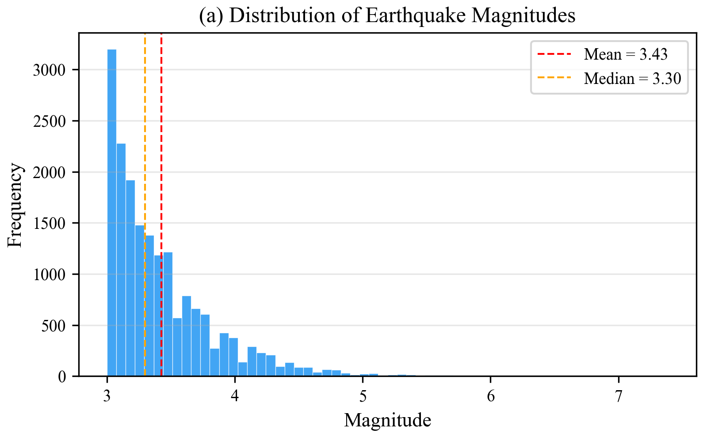
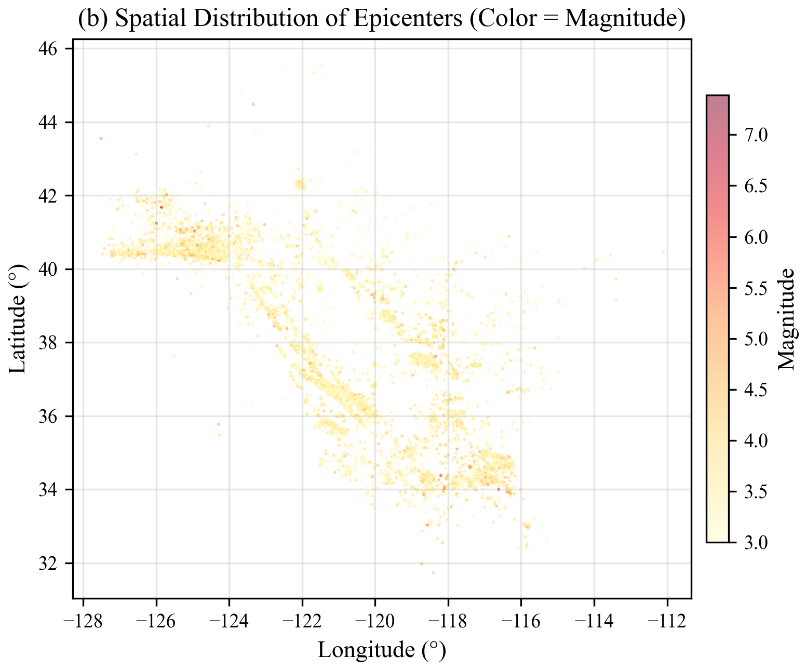
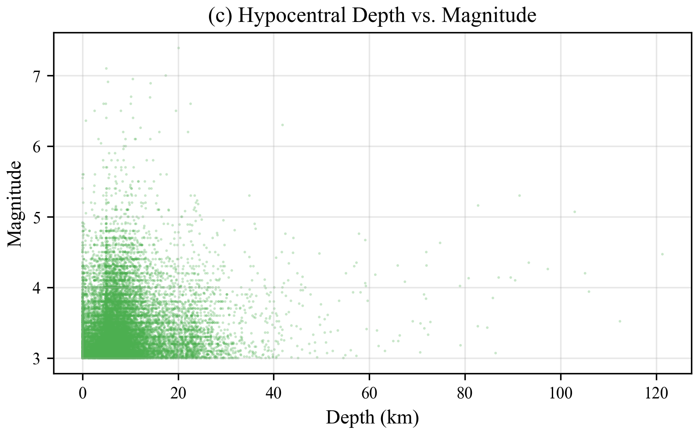
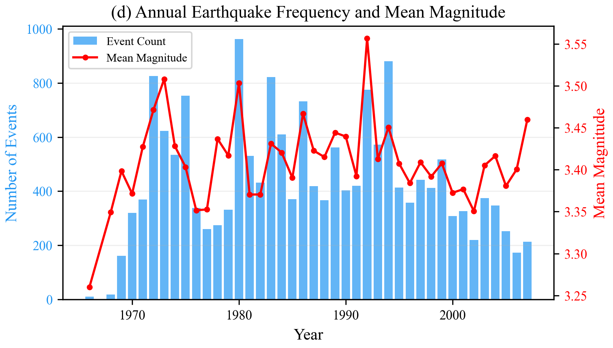
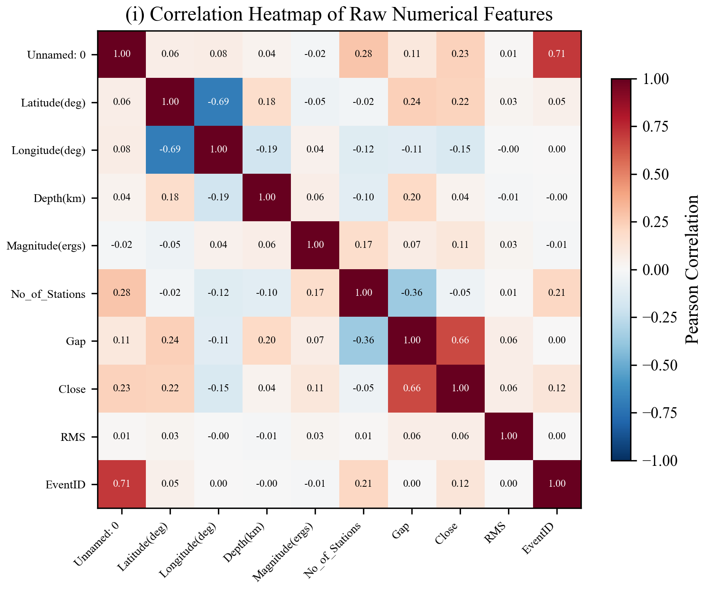
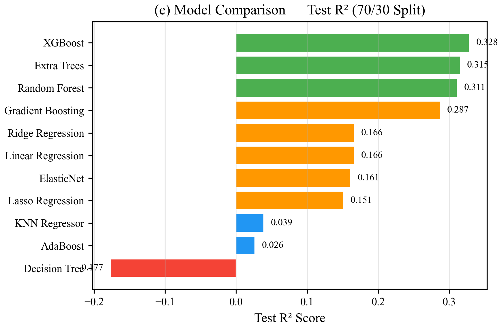
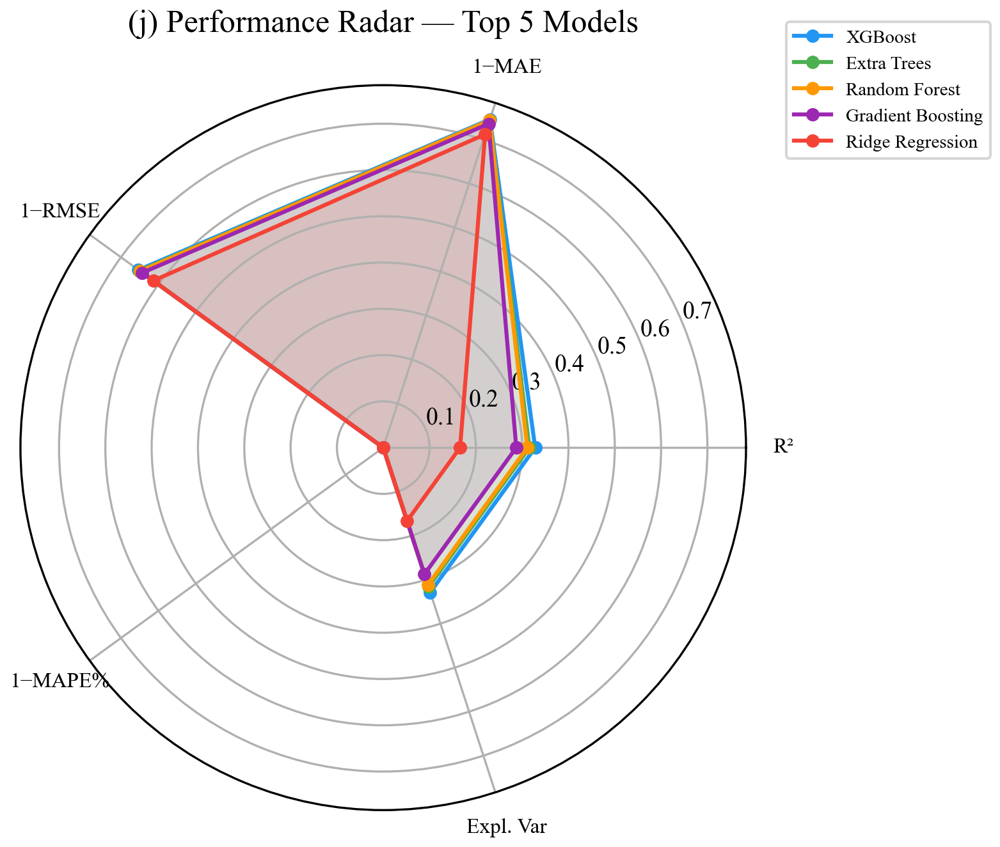
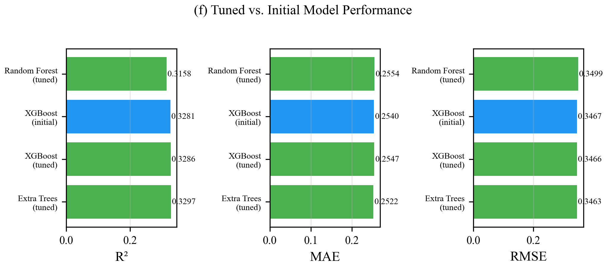
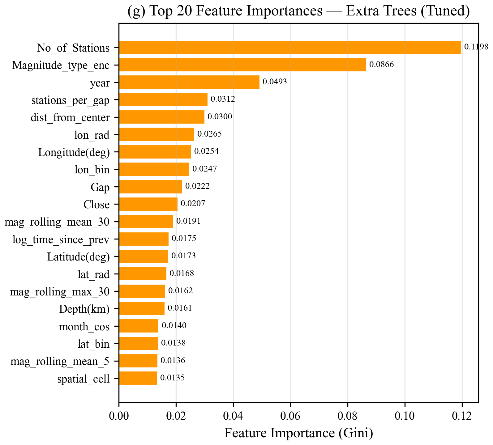
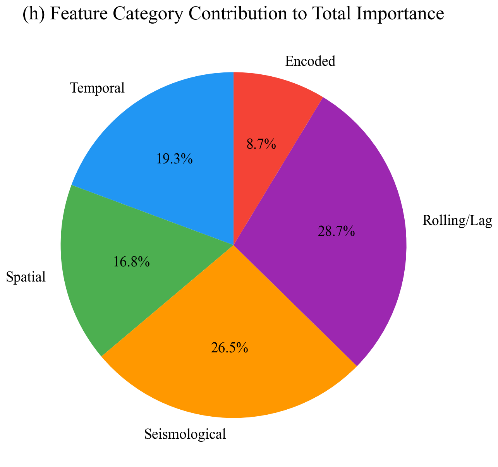

<div align="center">

# 🌍 Seismic Risk Assessment & ML Prediction Tool

**An end-to-end earthquake risk analysis platform combining interactive map-based visualization with a production-grade machine learning pipeline for magnitude estimation.**

[](https://www.python.org/)
[](https://streamlit.io/)
[](https://scikit-learn.org/)
[](https://xgboost.readthedocs.io/)
[](LICENSE)
[](#disclaimer)
[](ML_writup.pdf)

</div>

---

> **⚠️ IMPORTANT DISCLAIMER**
>
> This is a **risk assessment and educational tool** — **not** a real-time earthquake prediction system.
> Earthquakes **cannot** be reliably predicted with current science. Do not use this tool
> for evacuation decisions, safety-critical planning, or public advisories.
> Always consult official sources: [USGS](https://www.usgs.gov/natural-hazards/earthquake-hazards) · [Ready.gov](https://www.ready.gov/earthquakes) · [GEM](https://www.globalquakemodel.org/)

---

## Table of Contents

- [Overview](#overview)
- [Features](#features)
- [Demo Modes](#demo-modes)
- [Architecture](#architecture)
- [Project Structure](#project-structure)
- [Data Exploration & Analysis](#data-exploration--analysis)
- [ML Pipeline](#ml-pipeline)
  - [Dataset](#dataset)
  - [Feature Engineering (59 Features)](#feature-engineering-59-features)
  - [Algorithms (11 Models)](#algorithms-11-models)
  - [Benchmark Results](#benchmark-results)
  - [Hyperparameter Tuning](#hyperparameter-tuning)
  - [Feature Importance](#feature-importance)
- [Research Paper](#research-paper)
- [Installation](#installation)
- [Usage](#usage)
- [Configuration](#configuration)
- [Tech Stack](#tech-stack)
- [Ethical Considerations](#ethical-considerations)
- [Limitations](#limitations)
- [Contributing](#contributing)
- [Version History](#version-history)
- [License](#license)
- [References](#references)

---

## Overview

This project provides two integrated capabilities:

1. **Interactive Seismic Risk Assessment** — Explore 16+ global seismic zones on an interactive Folium map with heat density overlays, magnitude-color-coded markers, filtering, and data export.

2. **ML-Powered Magnitude Estimation** — An industry-standard machine learning pipeline that trains 11 regression algorithms on 18,030 California earthquakes (1966–2007), performs hyperparameter tuning, and uses the best model (Extra Trees, R² = 0.3297) to generate magnitude estimates in the app.

Both modes are accessible from a single Streamlit interface with a sidebar toggle, complete with automatic dark/light theme adaptation, comprehensive disclaimers, and a full in-app model benchmark dashboard with mathematical metric definitions.

> **📄 Full Research Paper:** A detailed IEEE-style academic writeup covering methodology, results, and analysis is available as [ML_writup.pdf](ML_writup.pdf).

---

## Features

### 🗺️ Risk Assessment Mode
- **Interactive Folium Maps** — Risk markers, heat density maps, and combined views
- **16 Global Seismic Zones** — Pacific Ring of Fire, Mediterranean-Alpine Belt, Mid-Atlantic Ridge
- **5-Level Magnitude Color Coding** — Micro → Minor → Light → Moderate → Strong → Major → Great
- **Real-Time Filtering** — Filter by region, seismic belt, magnitude range
- **Statistics Dashboard** — M7+/M6+/M5+ counts, average magnitude, average depth, top 10 events
- **Data Export** — Download filtered datasets as CSV

### 🤖 ML Prediction Mode
- **Trained Model Integration** — Loads `best_model.joblib` (Extra Trees with StandardScaler)
- **59 Engineered Features** — Spatial, temporal, seismological, rolling statistics, lag features
- **Region-Specific Forecasting** — 12 regions including Japan, Indonesia, Chile, California, etc.
- **Configurable Parameters** — Forecast window, minimum magnitude, depth range, confidence level
- **Probability Visualization** — Color-coded forecast markers on interactive maps

### 📊 Model Benchmark Dashboard (in-app)
- **Score Cards** — R², MAE, RMSE, MAPE, Explained Variance with color-coded indicators
- **Mathematical Formulas** — LaTeX-rendered definitions of each metric with model-specific interpretation
- **11-Model Comparison Table** — Interactive, sortable table with highlighted best scores
- **Tuned Model Comparison** — Pre- vs post-hyperparameter optimization results
- **Feature Importance Chart** — Horizontal bar chart (top 20) with full expandable table
- **Pipeline Info** — Models evaluated, features used, train/test split details

### 🎨 Design
- **Automatic Dark/Light Theme** — CSS variables with `prefers-color-scheme` and Streamlit's `data-theme`
- **Professional Sidebar** — Mode toggle, region selectors, sliders, map style options
- **Theme-Adaptive Map Legends** — Both magnitude and probability legends adapt to browser theme
- **Ethical Disclaimers** — Prominent warnings in every mode, following responsible AI practices

---

## Demo Modes

| Mode | Toggle | Description |
|------|--------|-------------|
| **Risk Assessment** | Off (default) | Historical risk visualization with 16 global seismic zones |
| **ML Prediction** | On | Experimental magnitude estimation using the trained ML pipeline |

Switch between modes using the **"Enable Prediction Mode"** toggle in the sidebar.

---

## Architecture

```
┌─────────────────────────────────────────────────────────────┐
│                    Streamlit Frontend                       │
│                       (app.py)                              │
│  ┌─────────────────┐    ┌─────────────────────────────────┐ │
│  │ Risk Assessment │    │       ML Prediction Mode        │ │
│  │  - Folium Maps  │    │  - Load best_model.joblib       │ │
│  │  - Heat Density │    │  - Build 59 features            │ │
│  │  - Data Export  │    │  - model.predict()              │ │
│  │  - Statistics   │    │  - Benchmark Dashboard          │ │
│  └─────────────────┘    └─────────────────────────────────┘ │
└───────────────────────────────┬─────────────────────────────┘
                                │
                     ┌──────────┴────────────┐
                     │     model_prep/       │
                     │     ML Pipeline       │
                     ├───────────────────────┤
                     │ feature_engineering   │  Raw CSV → 59 features
                     │ model_pipeline        │  Train 11 algorithms
                     │ hyperparameter_tuning │  RandomizedSearchCV
                     │ run_pipeline          │  End-to-end orchestrator
                     └──────────┬────────────┘
                                │
                     ┌──────────┴────────────┐
                     │  model_prep/output/   │
                     │  - best_model.joblib  │
                     │  - pipeline_report    │
                     │  - comparisons        │
                     │  - feature importance │
                     └───────────────────────┘
```

---

## Project Structure

```
earthquake-prediction/
├── app.py                              # Main Streamlit app (risk assessment + ML prediction)
├── app2.py                             # Legacy V1 app (deprecated)
├── requirements.txt                    # Python dependencies
├── README.md                           # This file
├── LICENSE                             # MIT License
├── .gitignore                          # Git ignore rules
├── ML_writup.pdf                       # IEEE-style research paper (compiled)
│
├── data/
│   └── Earthquake_data_processed.csv   # 18,030 rows — California (NCSN, 1966–2007)
│
├── model_prep/                         # ML Pipeline
│   ├── __init__.py
│   ├── feature_engineering.py          # Raw CSV → 59 engineered features
│   ├── model_pipeline.py              # Train & evaluate 11 algorithms (70/30 split)
│   ├── hyperparameter_tuning.py       # RandomizedSearchCV on top-K models
│   ├── run_pipeline.py                # End-to-end pipeline orchestrator
│   ├── README.md                      # Pipeline documentation
│   └── output/                        # Generated artifacts
│       ├── best_model.joblib          # Best model (StandardScaler + ExtraTrees)
│       ├── model_comparison.csv       # All 11 models performance table
│       ├── final_comparison.csv       # Tuned vs initial top models
│       ├── feature_importance.csv     # 59 features ranked by importance
│       ├── features.json              # Feature name list (for inference)
│       └── pipeline_report.json       # Full pipeline summary
│
├── paper/                              # Research figures
│   └── figures/                        # 10 high-res (300 DPI) analysis plots
│       ├── fig1_magnitude_distribution.png
│       ├── fig2_spatial_distribution.png
│       ├── fig3_depth_vs_magnitude.png
│       ├── fig4_temporal_distribution.png
│       ├── fig5_model_comparison.png
│       ├── fig6_tuned_vs_initial.png
│       ├── fig7_feature_importance.png
│       ├── fig8_feature_categories.png
│       ├── fig9_correlation_heatmap.png
│       └── fig10_metric_radar.png
│
└── .devcontainer/
    └── devcontainer.json              # GitHub Codespaces / Dev Container config
```

---

## Data Exploration & Analysis

Before building the ML pipeline, we performed extensive exploratory data analysis on the 18,030 NCSN catalog events. The following visualizations reveal key patterns in the data:

### Magnitude Distribution

The magnitude distribution follows the expected Gutenberg-Richter power law — the majority of events cluster near M3.0 with a right-skewed tail extending to M7.39.

<p align="center">
  
</p>

### Spatial Distribution of Epicenters

Epicenters cluster along known California fault systems, particularly the San Andreas Fault and its subsidiaries. Color encodes magnitude — larger events are scattered but concentrated in fault zones.

<p align="center">
  
</p>

### Depth vs. Magnitude

Most events are shallow (<20 km) with no strong depth-magnitude trend, consistent with California's predominantly shallow crustal seismicity.

<p align="center">
  
</p>

### Temporal Distribution

Annual earthquake frequency and mean magnitude over the 41-year observation period (1966–2007). Event counts increase over time partly due to expanding station coverage.

<p align="center">
  
</p>

### Feature Correlation Heatmap

Weak linear correlations between raw features and magnitude (strongest: `No_of_Stations` at r ≈ 0.35) motivate the use of nonlinear ensemble methods.

<p align="center">
  
</p>

---

## ML Pipeline

### Dataset

| Property | Value |
|----------|-------|
| **Source** | Northern California Seismic Network (NCSN) |
| **File** | `data/Earthquake_data_processed.csv` |
| **Records** | 18,030 earthquakes |
| **Period** | 1966–2007 |
| **Region** | California, USA |
| **Target** | `Magnitude(ergs)` (range: 3.0 – 7.39, mean: 3.43) |

**Raw Columns (13):**

| Column | Description |
|--------|-------------|
| `Date(YYYY/MM/DD)` | Event date |
| `Time(UTC)` | Event time |
| `Latitude(deg)` | Epicenter latitude |
| `Longitude(deg)` | Epicenter longitude |
| `Depth(km)` | Hypocentral depth |
| `Magnitude(ergs)` | **Target variable** — earthquake magnitude |
| `Magnitude_type` | Magnitude scale type |
| `No_of_Stations` | Number of recording stations |
| `Gap` | Azimuthal gap (degrees) |
| `Close` | Distance to nearest station |
| `RMS` | Root mean square travel-time residual |
| `SRC` | Source network (all NCSN) |
| `EventID` | Unique event identifier |

### Feature Engineering (59 Features)

The `feature_engineering.py` module transforms 13 raw columns into **59 ML-ready features** across 5 categories:

<details>
<summary><b>Temporal Features (16)</b></summary>

| Feature | Description |
|---------|-------------|
| `year`, `month`, `day_of_year`, `hour`, `day_of_week` | Calendar components |
| `month_sin`, `month_cos` | Cyclic encoding of month |
| `hour_sin`, `hour_cos` | Cyclic encoding of hour |
| `dow_sin`, `dow_cos` | Cyclic encoding of day of week |
| `time_since_prev` | Seconds since previous event |
| `log_time_since_prev` | Log-transformed inter-event time |

</details>

<details>
<summary><b>Spatial Features (8)</b></summary>

| Feature | Description |
|---------|-------------|
| `lat_rad`, `lon_rad` | Lat/lon in radians |
| `dist_from_center` | Euclidean distance from data centroid |
| `lat_bin`, `lon_bin` | Coarse grid binning (20 bins each) |
| `spatial_cell` | Combined spatial hash (`lat_bin × 20 + lon_bin`) |
| `Latitude(deg)`, `Longitude(deg)` | Original coordinates (retained) |

</details>

<details>
<summary><b>Seismological Derived (8)</b></summary>

| Feature | Description |
|---------|-------------|
| `log_depth` | `log1p(Depth)` |
| `stations_per_gap` | `No_of_Stations / (Gap + 1)` |
| `close_depth_interaction` | `Close × Depth` |
| `rms_log` | `log1p(RMS)` |
| `gap_close_ratio` | `Gap / (Close + 1)` |
| `Depth(km)`, `No_of_Stations`, `Gap`, `Close`, `RMS` | Original numeric columns |

</details>

<details>
<summary><b>Rolling & Lag Statistics (25)</b></summary>

| Feature | Description |
|---------|-------------|
| `mag_rolling_mean_{5,10,30}` | Rolling mean of past magnitudes (shifted to prevent leakage) |
| `mag_rolling_std_{5,10,30}` | Rolling standard deviation |
| `mag_rolling_max_{5,10,30}` | Rolling maximum |
| `depth_rolling_mean_{5,10,30}` | Rolling mean of past depths |
| `mag_lag_{1,2,3}` | Previous 1st/2nd/3rd event magnitude |
| `depth_lag_{1,2,3}` | Previous 1st/2nd/3rd event depth |
| `lat_lag_{1,2,3}`, `lon_lag_{1,2,3}` | Previous event coordinates |
| `mag_diff_lag1_lag2` | `mag_lag_1 − mag_lag_2` (leakage-free difference) |
| `mag_diff_lag2_lag3` | `mag_lag_2 − mag_lag_3` |
| `spatial_event_count_30` | Events in same spatial cell (rolling 30) |

</details>

<details>
<summary><b>Encoded (2)</b></summary>

| Feature | Description |
|---------|-------------|
| `Magnitude_type_enc` | Label-encoded magnitude type |

</details>

> **Data Leakage Prevention:** All lag/rolling features use `shift(1)` to ensure only past data is used. The `mag_diff` features use only lagged values (lag1−lag2, lag2−lag3), never the current target.

### Algorithms (11 Models)

All models are wrapped in a `sklearn.pipeline.Pipeline` with `StandardScaler` → estimator:

| # | Algorithm | Key Hyperparameters |
|---|-----------|-------------------|
| 1 | Linear Regression | Baseline (no regularization) |
| 2 | Ridge Regression | α = 1.0 |
| 3 | Lasso Regression | α = 0.01, max_iter = 5000 |
| 4 | ElasticNet | α = 0.01, l1_ratio = 0.5 |
| 5 | Decision Tree | max_depth = 15 |
| 6 | Random Forest | 100 trees, max_depth = 15, n_jobs = −1 |
| 7 | Gradient Boosting | 50 trees, max_depth = 4, lr = 0.1 |
| 8 | AdaBoost | 50 estimators, lr = 0.1 |
| 9 | K-Nearest Neighbors | k = 7, distance-weighted, n_jobs = −1 |
| 10 | Extra Trees | 100 trees, max_depth = 15, n_jobs = −1 |
| 11 | XGBoost | 100 trees, max_depth = 6, lr = 0.1, n_jobs = −1 |

### Benchmark Results

**Initial Sweep (70/30 split, no CV):**

| Rank | Model | Train R² | Test R² | Test MAE | Test RMSE | MAPE % | Time |
|------|-------|----------|---------|----------|-----------|--------|------|
| 1 | **XGBoost** | 0.6268 | **0.3281** | 0.2540 | 0.3467 | 7.18 | 0.5s |
| 2 | Extra Trees | 0.7467 | 0.3154 | 0.2565 | 0.3500 | 7.25 | 1.3s |
| 3 | Random Forest | 0.7263 | 0.3113 | 0.2563 | 0.3510 | 7.24 | 7.2s |
| 4 | Gradient Boosting | 0.3659 | 0.2873 | 0.2643 | 0.3571 | 7.46 | 11.2s |
| 5 | Ridge Regression | 0.1632 | 0.1659 | 0.2880 | 0.3863 | 8.15 | 0.0s |
| 6 | Linear Regression | 0.1632 | 0.1659 | 0.2880 | 0.3863 | 8.15 | 0.0s |
| 7 | ElasticNet | 0.1540 | 0.1612 | 0.2897 | 0.3874 | 8.19 | 0.0s |
| 8 | Lasso Regression | 0.1449 | 0.1512 | 0.2919 | 0.3897 | 8.25 | 0.0s |
| 9 | KNN Regressor | 1.0000 | 0.0389 | 0.3040 | 0.4146 | 8.55 | 0.0s |
| 10 | AdaBoost | 0.0736 | 0.0264 | 0.3375 | 0.4173 | 9.84 | 7.7s |
| 11 | Decision Tree | 0.7158 | −0.1770 | 0.3083 | 0.4589 | 8.66 | 0.8s |

<p align="center">
  
</p>

<p align="center">
  
</p>

### Hyperparameter Tuning

Top 3 models tuned with **RandomizedSearchCV** (20 iterations, 5-fold CV):

| Model | Test R² | Test MAE | Test RMSE | MAPE % | CV R² |
|-------|---------|----------|-----------|--------|-------|
| **Extra Trees (tuned)** | **0.3297** | **0.2522** | **0.3463** | **7.12** | 0.3037 |
| XGBoost (tuned) | 0.3286 | 0.2547 | 0.3466 | 7.19 | 0.2960 |
| Random Forest (tuned) | 0.3158 | 0.2554 | 0.3499 | 7.22 | 0.2929 |

**Best Model: Extra Trees (tuned)**

```
n_estimators    = 300
max_depth       = 20
min_samples_split = 5
min_samples_leaf  = 4
```

<p align="center">
  
</p>

**Metric Definitions:**

| Metric | Formula | Our Score | Interpretation |
|--------|---------|-----------|----------------|
| **R²** | 1 − SS_res / SS_tot | 0.3297 | Explains 33.0% of magnitude variance |
| **MAE** | (1/n) Σ\|yᵢ − ŷᵢ\| | 0.2522 | Average error ± 0.25 magnitude units |
| **RMSE** | √((1/n) Σ(yᵢ − ŷᵢ)²) | 0.3463 | Penalizes large errors more than MAE |
| **MAPE** | (100/n) Σ\|yᵢ − ŷᵢ\|/\|yᵢ\| | 7.12% | Scale-independent percentage error |
| **Explained Var** | 1 − Var(y − ŷ) / Var(y) | 0.3302 | Similar to R² without bias penalty |

> **Note:** R² ≈ 0.33 is realistic for earthquake magnitude prediction from spatial/temporal features. Earthquake magnitude is inherently stochastic and influenced by deep geological processes not captured in surface measurements.

### Feature Importance

Top 15 features by Extra Trees importance:

```
No_of_Stations          ████████████  11.98%
Magnitude_type_enc      █████████     8.66%
year                    █████         4.93%
stations_per_gap        ███           3.12%
dist_from_center        ███           3.00%
lon_rad                 ███           2.65%
Longitude(deg)          ██            2.54%
lon_bin                 ██            2.47%
Gap                     ██            2.22%
Close                   ██            2.07%
mag_rolling_mean_30     ██            1.91%
log_time_since_prev     ██            1.75%
Latitude(deg)           ██            1.73%
lat_rad                 ██            1.68%
mag_rolling_max_30      ██            1.62%
```

`No_of_Stations` (12%) is the strongest predictor — more recording stations correlate with higher magnitudes due to detection bias and network geometry.

<p align="center">
  
</p>

<p align="center">
  
</p>

---

## Research Paper

A full IEEE Transactions-style academic paper accompanies this project:

**📄 [ML_writup.pdf](ML_writup.pdf)** — *"Earthquake Magnitude Estimation Using Ensemble Machine Learning with Engineered Spatiotemporal Features"*

The paper covers:
- **Introduction** — Scientific context and motivation for catalog-based magnitude estimation
- **Related Work** — Survey of ML in seismology (neural networks, SVMs, ensemble methods)
- **Dataset** — Detailed description of the NCSN catalog (18,030 events, 13 columns)
- **Methodology** — Feature engineering (59 features), cyclic encoding equations, rolling statistics formulas, leakage prevention, model selection, evaluation protocol with mathematical metric definitions (R², MAE, RMSE, MAPE, EV)
- **Experimental Results** — Full 11-model comparison, hyperparameter tuning, feature importance analysis
- **Discussion** — Interpretation of R² ≈ 0.33, station count as top predictor, ensemble superiority, overfitting patterns, limitations, ethical considerations
- **Conclusion** — Summary and future work (waveform deep learning, transfer learning, probabilistic regression)

All figures in the paper are available at high resolution (300 DPI) in [`paper/figures/`](paper/figures/).

---

## Installation

### Prerequisites

- Python 3.10+ (tested on 3.12)
- pip or conda

### Quick Start

```bash
# Clone the repository
git clone https://github.com/ariktheone/earthquake-prediction.git
cd earthquake-prediction

# Create virtual environment
python -m venv venv
source venv/bin/activate  # macOS/Linux
# venv\Scripts\activate   # Windows

# Install dependencies
pip install -r requirements.txt

# Run the app
streamlit run app.py
```

### Run the ML Pipeline (optional — model is pre-built)

```bash
cd model_prep
python run_pipeline.py
```

This will:
1. Load `data/Earthquake_data_processed.csv`
2. Engineer 59 features
3. Train 11 models (70/30 split)
4. Tune top 3 models with RandomizedSearchCV
5. Export the best model and reports to `model_prep/output/`

> Pipeline takes ~28 minutes on a standard machine.

### GitHub Codespaces

A `.devcontainer/devcontainer.json` is included for one-click setup in GitHub Codespaces.

---

## Usage

### Risk Assessment Mode (Default)

1. Open the app (`streamlit run app.py`)
2. Use the sidebar to:
   - Select **Geographic Scope** (Global, Pacific Ring of Fire, etc.)
   - Adjust **Magnitude Range** slider (1.0–9.0)
   - Choose **Map Style** (Light, Dark, Street, Satellite)
   - Pick **Visualization Mode** (Risk Markers, Heat Density, Combined)
3. Explore the interactive map — click markers for details
4. View the **Statistics Dashboard** and **Top 10 Strongest Events**
5. Download data as CSV

### ML Prediction Mode

1. Toggle **"Enable Prediction Mode"** in the sidebar
2. Select a **Prediction Region** (California, Japan, Indonesia, etc.)
3. Set the **Forecast Window** (30 days to 1 year)
4. Adjust **Minimum Magnitude**, **Depth Range**, and **Confidence Level**
5. View the forecast map with probability-colored markers
6. Scroll down to see the **Model Benchmark & Performance** section:
   - Score cards (R², MAE, RMSE, MAPE, Explained Variance)
   - Mathematical definitions of each metric (LaTeX-rendered)
   - All 11 models comparison table
   - Tuned models comparison
   - Feature importance chart
   - Pipeline info

---

## Configuration

### Adding New Seismic Zones

In `app.py`, add to the `seismic_zones` list:

```python
{"name": "Haiti", "lat_range": (18, 20), "lon_range": (-74, -71),
 "mag_range": (4.0, 7.5), "samples": 15,
 "belt": "Caribbean Plate", "region": "Americas"},
```

### Adjusting ML Pipeline

Edit `model_prep/run_pipeline.py`:

```python
run_pipeline(
    tune_top_k=5,      # Tune top 5 instead of 3
    tune_n_iter=50,     # More hyperparameter combinations
    test_size=0.25,     # 75/25 split instead of 70/30
)
```

### Map Styles

```python
tile_options = {
    "Light Theme": "CartoDB.Positron",
    "Dark Theme": "CartoDB.DarkMatter",
    "Street Map": "OpenStreetMap",
    "Satellite": "Esri.WorldImagery",
}
```

---

## Tech Stack

| Category | Technology | Version |
|----------|-----------|---------|
| **Frontend** | Streamlit | ≥ 1.40 |
| **Maps** | Folium + streamlit-folium | ≥ 0.18 |
| **ML** | scikit-learn | latest |
| **Boosting** | XGBoost | ≥ 1.7 |
| **Data** | Pandas, NumPy | ≥ 2.1 / ≥ 1.26 |
| **Serialization** | joblib | latest |
| **Geocoding** | GeoPy (Nominatim) | ≥ 2.3 |
| **Language** | Python | 3.12 |

---

## Ethical Considerations

### Why Risk Assessment, Not Prediction

The scientific consensus is clear: **earthquakes cannot be reliably predicted.** This tool is designed with this reality in mind:

- **Assessment mode** uses only known seismic zones and historical data
- **Prediction mode** is clearly labeled as "EXPERIMENTAL" with prominent disclaimers
- **No false certainty** — probability values represent relative statistical likelihood, not actual prediction confidence
- **Responsible language** — the app consistently uses "estimate", "forecast", "assessment" rather than "prediction" where possible
- **Official resource links** — USGS, Ready.gov, and GEM are linked throughout

### What This Tool Should NOT Be Used For

- ❌ Making evacuation decisions
- ❌ Public warnings or advisories
- ❌ Insurance or financial decisions
- ❌ Any action assuming specific earthquakes can be predicted

### What This Tool IS For

- ✅ Understanding historical seismic patterns
- ✅ Learning about tectonic plate boundaries
- ✅ Educational exploration of ML applied to geoscience
- ✅ Research and academic study

---

## Limitations

### Scientific
- Earthquake prediction remains **scientifically unsolved**
- Surface measurements cannot capture deep geological processes
- Magnitude is inherently stochastic — R² ≈ 0.33 reflects this fundamental uncertainty

### Technical
- Dataset is limited to **California (NCSN)** 1966–2007 — the model may not generalize to other regions
- Lag/rolling features assume temporal ordering — out-of-distribution temporal gaps may reduce accuracy
- The 59-feature model relies on seismological inputs (station count, gap, RMS) not always available in real-time

### Practical
- Model benchmark scores (R² = 0.33) indicate **moderate predictive power** — useful for relative comparisons, not precise predictions
- Probability values in the app are statistical estimates, not calibrated probabilities
- The app generates synthetic seismological inputs for prediction mode — real-time sensor integration is not implemented

---

## Contributing

Contributions are welcome! Please:

1. Fork the repository
2. Create a feature branch (`git checkout -b feature/your-feature`)
3. Commit your changes (`git commit -m 'Add your feature'`)
4. Push to the branch (`git push origin feature/your-feature`)
5. Open a Pull Request

### Guidelines
- Maintain ethical disclaimers in any new features
- Add tests for new ML pipeline components
- Follow existing code style and project structure
- Do not make or imply earthquake predictions are possible

---

## Version History

| Version | Date | Changes |
|---------|------|---------|
| **3.0** | March 2026 | ML pipeline integration, 11-model benchmark, in-app metrics dashboard, trained model predictions, feature importance visualization, LaTeX metric formulas |
| **2.0** | March 2026 | Ethical redesign: risk assessment focus, dark/light theme, prediction mode with disclaimers, interactive maps |
| **1.0** | Original | Basic prediction app (`app2.py`, deprecated) using single Random Forest model |

---

## License

MIT License — see [LICENSE](LICENSE) for details.

**Additional ethical terms:** This software must not be used to create, distribute, or imply earthquake predictions that could endanger public safety. Any derivative work must include clear disclaimers that earthquake prediction is scientifically impossible with current technology.

---

## References

- **USGS** — [Earthquake Hazards Program](https://www.usgs.gov/natural-hazards/earthquake-hazards)
- **ISC** — [International Seismological Centre](http://www.isc.ac.uk/)
- **IRIS** — [Incorporated Research Institutions for Seismology](https://www.iris.edu/)
- **GEM** — [Global Earthquake Model Foundation](https://www.globalquakemodel.org/)
- **NCSN** — [Northern California Seismic Network](https://ncedc.org/)
- **Ready.gov** — [Earthquake Preparedness](https://www.ready.gov/earthquakes)
- Geller, R.J. (1997). *Earthquake prediction: a critical review.* Geophysical Journal International, 131(3), 425-450.
- Hough, S.E. (2010). *Predicting the Unpredictable: The Tumultuous Science of Earthquake Prediction.* Princeton University Press.

---

<div align="center">

**Built for education & research. Always rely on official sources for earthquake safety.**

*This tool does not predict earthquakes.*

</div>
